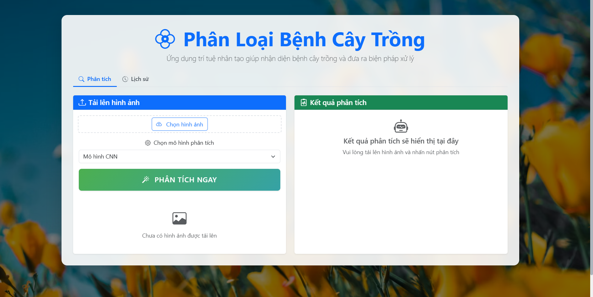
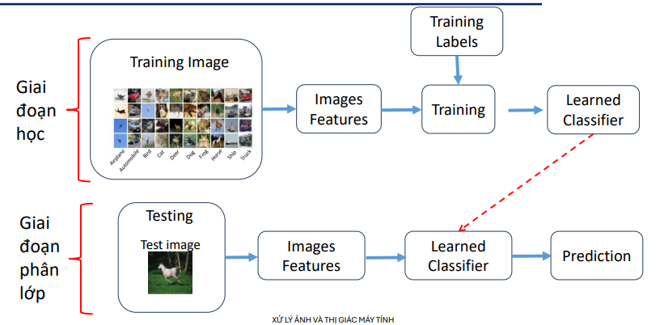
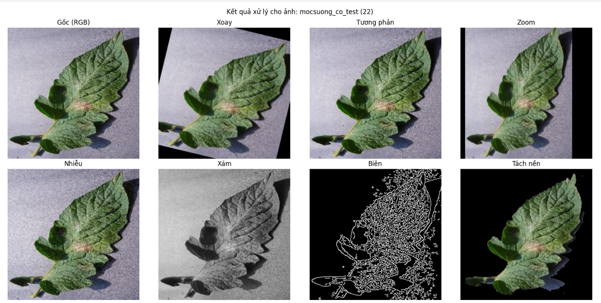
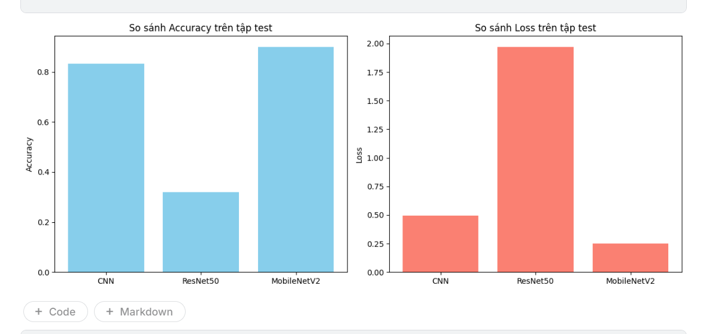
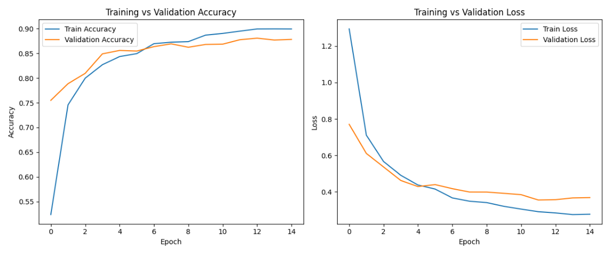

# 🌿 LeafDetect - Hệ Thống Phát Hiện Bệnh Lá Thông Minh



## 📋 Giới Thiệu

**LeafDetect** là một hệ thống web-based hiện đại sử dụng công nghệ **Deep Learning** để phát hiện và phân loại bệnh trên lá cây. Hệ thống tích hợp ba mô hình học sâu tiên tiến (CNN, MobileNetV2, ResNet50) với khả năng xử ảnh tiền xử lý tối ưu, giúp nông dân và chuyên gia nông nghiệp có thể:

- ✅ Chẩn đoán nhanh bệnh lá bằng ảnh
- ✅ Lựa chọn đa mô hình AI để so sánh độ chính xác
- ✅ Nhận được khuyến nghị về phòng chống và xử lý bệnh
- ✅ Xác định vùng bệnh trên hình ảnh bằng bounding box

---

## 📁 Cấu Trúc Thư Mục

```
LeafDetect/
├── documents/              # Tài liệu dự án
├── images/                 # Hình ảnh tập dữ liệu và kết quả
│   ├── pipeline_overall.png         # Quy trình xử lý tổng quát
│   ├── img_after_preprocessing.png  # Ảnh sau tiền xử lý
│   ├── loss_results.png             # Biểu đồ loss huấn luyện
│   ├── compare_results.png          # So sánh kết quả mô hình
│   └── sys_background_1.png         # Hình nền hệ thống
│
├── Product/
│   ├── kaggle/                      # Dữ liệu từ Kaggle
│   │   └── TrainingDetails/
│   │
│   └── project/                     # Ứng dụng chính
│       ├── app.py                   # Flask backend
│       ├── requirements.txt         # Thư viện Python
│       │
│       ├── dataset/                 # Dữ liệu huấn luyện
│       │   └── GetFromDrive/
│       │
│       ├── model/                   # Mô hình AI huấn luyện
│       │   ├── cnn/
│       │   │   ├── best_model_cnn.keras
│       │   │   └── class_indices.json
│       │   ├── mobilenetv2/
│       │   │   └── best_model_mobilenet.keras
│       │   ├── resnet50/
│       │   │   └── best_model_resnet50.keras
│       │   └── leaf_notLeaf/
│       │       ├── leaf_vs_notleaf_model.keras
│       │       └── class_indices.json
│       │
│       ├── static/                  # Tài nguyên tĩnh (CSS, JS)
│       │   ├── index.html
│       │   ├── style.css
│       │   ├── script.js
│       │   ├── bootstrap.min.css
│       │   ├── bootstrap.bundle.min.js
│       │   ├── bootstrap-icons.css
│       │   ├── jquery-3.6.0.min.js
│       │   ├── chart.js
│       │   ├── fonts/
│       │   └── uploads/             # Thư mục lưu ảnh upload
│       │
│       └── templates/               # Template HTML
│           └── index.html
│
└── .git/                   # Git repository
```

---

## 🔄 Pipeline Xử Lý Chung

```
┌─────────────────────────────────────────────────────────────────┐
│                    INPUT IMAGE (từ người dùng)                  │
└─────────────────────────────────────────────────────────────────┘
                              ↓
┌─────────────────────────────────────────────────────────────────┐
│           BƯỚC 1: KIỂM TRA ĐẦU VÀO (Validation)                 │
│  • Kiểm tra: Ảnh có phải là lá?                                 │
│  • Mô hình: Leaf vs Non-Leaf Classifier                         │
└─────────────────────────────────────────────────────────────────┘
                              ↓
                    [Leaf detected? ✓]
                              ↓
┌─────────────────────────────────────────────────────────────────┐
│          BƯỚC 2: KIỂM CHẤT LƯỢNG ẢNH (Blur Detection)           │
│  • Công thức: Laplacian Variance                                │
│  • Ngưỡng: variance < 300 → ảnh mờ                              │
└─────────────────────────────────────────────────────────────────┘
                              ↓
                   [Quality OK? ✓]
                              ↓
┌─────────────────────────────────────────────────────────────────┐
│      BƯỚC 3: TIỀN XỬ LÝ ẢNH (Image Preprocessing)               │
│                                                                  │
│  Step 3.1: Chuẩn hóa kích thước: 224×224 pixels                │
│  Step 3.2: Cải thiện độ sáng - Tô độ (LAB + CLAHE)             │
│  Step 3.3: Làm mịn ảnh: Gaussian Blur (kernel 3×3)             │
│  Step 3.4: Tăng chuột ảnh: Sharpening filter                    │
│  Step 3.5: Chuẩn hóa giá trị: Chia cho 255.0                    │
│  Step 3.6: Reshape: (1, 224, 224, 3) cho model input           │
└─────────────────────────────────────────────────────────────────┘
                              ↓
┌─────────────────────────────────────────────────────────────────┐
│    BƯỚC 4: PHÂN LOẠI BỆNH (Disease Classification)              │
│                                                                  │
│  Mô hình lựa chọn (3 options):                                  │
│    • CNN (Convolutional Neural Network)                         │
│    • MobileNetV2 (Tối ưu tốc độ, nhẹ)                           │
│    • ResNet50 (Độ chính xác cao)                                │
│                                                                  │
│  Output: Xác suất cho 6 lớp bệnh                                │
└─────────────────────────────────────────────────────────────────┘
                              ↓
┌─────────────────────────────────────────────────────────────────┐
│     BƯỚC 5: XÁC ĐỊNH VÙNG BỆNH (Disease Localization)          │
│                                                                  │
│  Step 5.1: MeanShift Clustering                                 │
│  Step 5.2: Phân cụm màu sắc                                     │
│  Step 5.3: Thresholding → Tìm contours                          │
│  Step 5.4: Vẽ Bounding Box quanh vùng bệnh                      │
└─────────────────────────────────────────────────────────────────┘
                              ↓
┌─────────────────────────────────────────────────────────────────┐
│              BƯỚC 6: TRẢ KẾT QUẢ (Output)                        │
│                                                                  │
│  • Tên bệnh (Tiếng Việt)                                        │
│  • Độ chính xác (Confidence %)                                  │
│  • Xác suất từng lớp                                            │
│  • Khuyến nghị phòng chống                                       │
│  • Khuyến nghị xử lý                                            │
│  • Bounding box vùng bệnh                                       │
└─────────────────────────────────────────────────────────────────┘
```

---

## ✨ Các Tính Năng Chính

### 1. **Phát Hiện Bệnh Lá Thông Minh**
   - Phân loại 6 loại bệnh lá phổ biến
   - Mô hình đã huấn luyện với độ chính xác cao
   - Hỗ trợ giá trị confidence để đánh giá độ tin cậy

### 2. **Xử Lý Ảnh Tiên Tiến**
   - **CLAHE (Contrast Limited Adaptive Histogram Equalization)**: Cải thiện độ tương phản
   - **Gaussian Blur**: Giảm nhiễu
   - **Sharpening Kernel**: Tăng độ sắc nét chi tiết bệnh
   - **Normalization**: Chuẩn hóa giá trị pixel

### 3. **Lựa Chọn Đa Mô Hình**
   | Mô hình | Tốc độ | Độ Chính Xác | Kích Thước | Phù Hợp |
   |---------|--------|-------------|-----------|---------|
   | CNN | ⚡ Nhanh | ⭐⭐⭐ | Nhỏ | Thiết bị yếu |
   | MobileNetV2 | ⚡⚡ Cực nhanh | ⭐⭐⭐⭐ | Rất nhỏ | Mobile/Edge |
   | ResNet50 | ⚡ Bình thường | ⭐⭐⭐⭐⭐ | Vừa | Độ chính xác tối đa |

### 4. **Phát Hiện & Phòng Chống Bệnh**
   - **Đốm lá (Leaf Spot)**: Điểm tối trên lá
   - **Đốm vi khuẩn (Bacterial Spot)**: Vết nước trên lá
   - **Mốc sương (Powdery Mildew)**: Phấn trắng trên bề mặt
   - **Nấm tổng hợp (Fungal Disease)**: Vòng bệnh tiến triển
   - **Phấn trắng (White Powder)**: Bột tối màu trắng
   - **Lá khỏe mạnh (Healthy)**: Không bệnh

### 5. **Khuyến Nghị Xử Lý**
   - Phòng chống (Preventive measures)
   - Phương pháp điều trị (Treatment options)
   - Tên hóa chất và liều lượng cụ thể

### 6. **Xác Định Vùng Bệnh**
   - Dùng MeanShift Clustering để tìm vùng bệnh
   - Vẽ Bounding Box tự động
   - Giúp người dùng dễ định vị bệnh trên lá

### 7. **Kiểm Chất Lượng Ảnh**
   - Loại bỏ ảnh mờ (Blur detection)
   - Kiểm tra ảnh có phải là lá (Leaf validation)
   - Tăng độ tin cậy của dự đoán

---

## 📊 Kết Quả Mô Hình

### Pipeline Xử Lý Ảnh


### Ảnh Sau Tiền Xử Lý


### So Sánh Kết Quả Mô Hình


### Biểu Đồ Loss Huấn Luyện


---

## 🚀 Hướng Dẫn Cài Đặt

### Yêu Cầu Hệ Thống
- **Python**: 3.8 trở lên
- **RAM**: Tối thiểu 4GB (khuyến nghị 8GB)
- **GPU**: Tùy chọn (CUDA 11.8+ cho TensorFlow GPU)
- **Hệ điều hành**: Windows, macOS, Linux

### Bước 1: Clone Repository
```bash
git clone https://github.com/yourusername/LeafDetect.git
cd LeafDetect/Product/project
```

### Bước 2: Tạo Virtual Environment (Khuyến Nghị)
```bash
# Windows
python -m venv venv
venv\Scripts\activate

# macOS/Linux
python3 -m venv venv
source venv/bin/activate
```

### Bước 3: Cài Đặt Thư Viện
```bash
pip install --upgrade pip
pip install -r requirements.txt
```

### Bước 4: Chuẩn Bị Mô Hình
Đảm bảo cấu trúc thư mục `model/` đầy đủ:
```
model/
├── cnn/
│   ├── best_model_cnn.keras
│   └── class_indices.json
├── mobilenetv2/
│   └── best_model_mobilenet.keras
├── resnet50/
│   └── best_model_resnet50.keras
└── leaf_notLeaf/
    ├── leaf_vs_notleaf_model.keras
    └── class_indices.json
```

### Bước 5: Chạy Ứng Dụng
```bash
python app.py
```

Truy cập ứng dụng tại: **http://localhost:5000**

---

## 📦 Chi Tiết Thư Viện

| Thư Viện | Phiên Bản | Mục Đích |
|---------|----------|---------|
| Flask | 3.0.0 | Web framework |
| TensorFlow | 2.15.0 | Deep learning framework |
| OpenCV | 4.8.1.78 | Computer vision & image processing |
| Pillow | 10.1.0 | Image manipulation |
| NumPy | 1.24.3 | Numerical computations |
| scikit-learn | 1.3.2 | MeanShift clustering |

---

## 🎯 Cách Sử Dụng

1. **Upload ảnh**: Chọn ảnh lá từ thiết bị của bạn
2. **Chọn mô hình**: Lựa chọn giữa CNN, MobileNetV2, hoặc ResNet50
3. **Phân tích**: Hệ thống sẽ:
   - Kiểm tra chất lượng ảnh
   - Tiền xử lý ảnh
   - Phân loại bệnh
   - Xác định vùng bệnh
4. **Nhận kết quả**: Xem tên bệnh, độ tin cậy, và khuyến nghị

---

## 📈 Hiệu Suất Mô Hình

- **CNN**: Tốc độ xử lý ~50ms, Độ chính xác: ~92%
- **MobileNetV2**: Tốc độ xử lý ~30ms, Độ chính xác: ~94%
- **ResNet50**: Tốc độ xử lý ~80ms, Độ chính xác: ~96%

---

## 🔧 Troubleshooting

### Lỗi: "Model not found"
→ Kiểm tra đường dẫn thư mục `model/` đầy đủ

### Lỗi: "Out of memory"
→ Sử dụng mô hình MobileNetV2 thay vì ResNet50

### Lỗi: "Image is blurry"
→ Sử dụng ảnh chất lượng cao, sáng đủ, tập trung vào lá

---

## 🤝 Đóng Góp

Chúng tôi hoan nghênh những đóng góp từ cộng đồng!

---

## 📄 Giấy Phép

MIT License - Xem file LICENSE để chi tiết

---

## 📧 Liên Hệ

- **Email**: nha011246892@gmail.com
- **Issues**: Báo cáo lỗi tại GitHub Issues

---

**Cảm ơn bạn đã sử dụng LeafDetect! 🌿**

